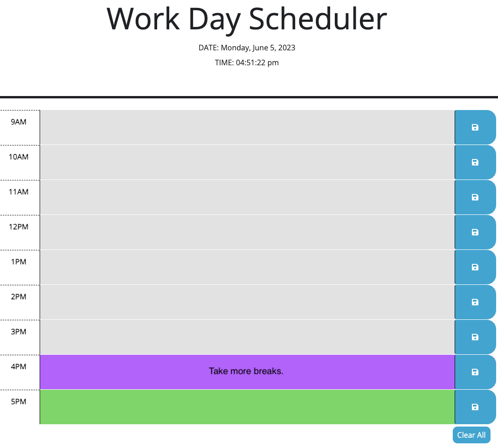

# Work Day Scheduler

## Description:
* A simple Work Day Scheduler application that allows users to save text entry for each hour of the day from 9am to 5pm.

## Installation:
* On a web browser please follow the link to begin exploring. [Work Day Scheduler.](https://junel-balbin.github.io/BC5-Work-Day-Scheduler/)

* Accessible on any mobile device and tablet.

## Usage:

* On the top of the page you will locate the displayed current day, date & time.

* The applications displays the work day hours of 9am - 5pm.

* Each time block is color coded. Grey colors represents past hours, Purple color represents current hour and Green colors represents future colors.

* Each time block allows users to input text for entry.

* Users can save into their local storage. You can locate the floppy disk icon on the right side of the page.

* Users can also clear all saved text entry by clicking or pressing the Clear All button located on the bottom right of the page.

## Credits & Resources:

* Starter Code provided by EdX and UCB.
* Bard & ChatGpt for troubleshooting.
* Stack Overflow, MDN & w3schools.
* Google search & Youtube videos.

## Coded With:
* HTML, CSS & JavaScript.
* Visual Studio Code.
* [Google Fonts](https://fonts.google.com/)
* [jQuery](https://jquery.com/)
* [Day.js](https://day.js.org/)

## Contributing:

* Any ideas or feedback is very much appreciated.

## License:

* MIT License.